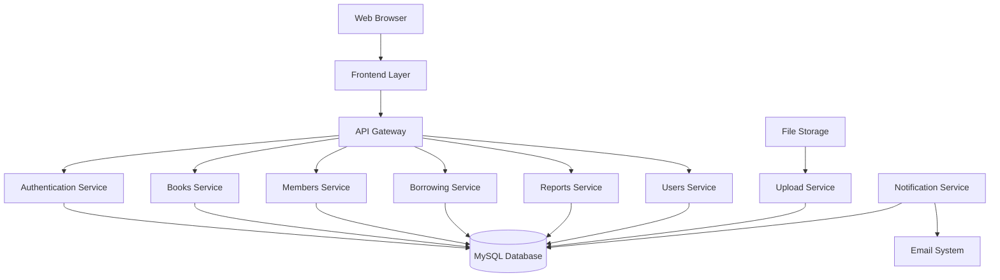
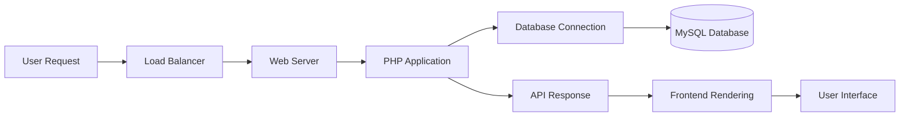
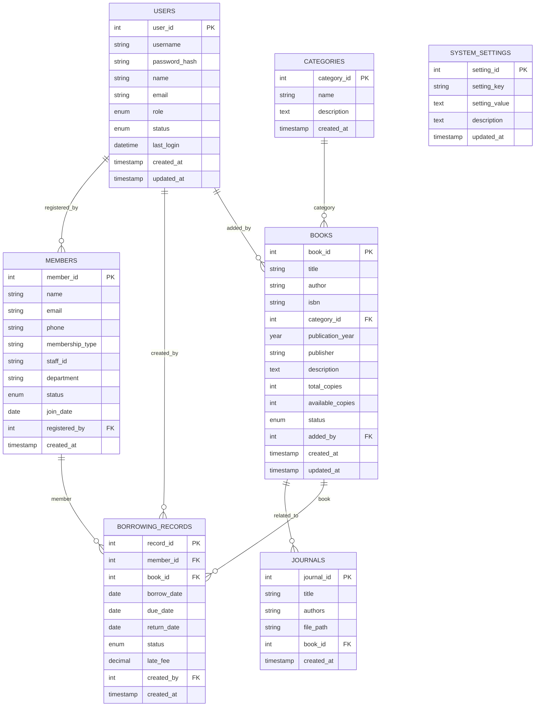
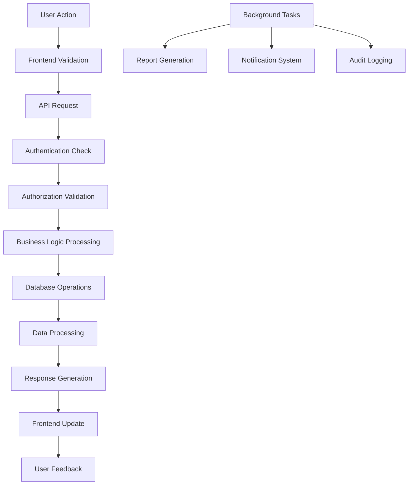
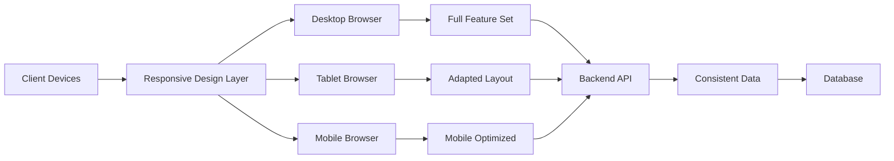
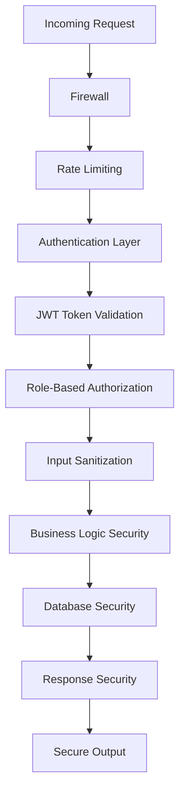
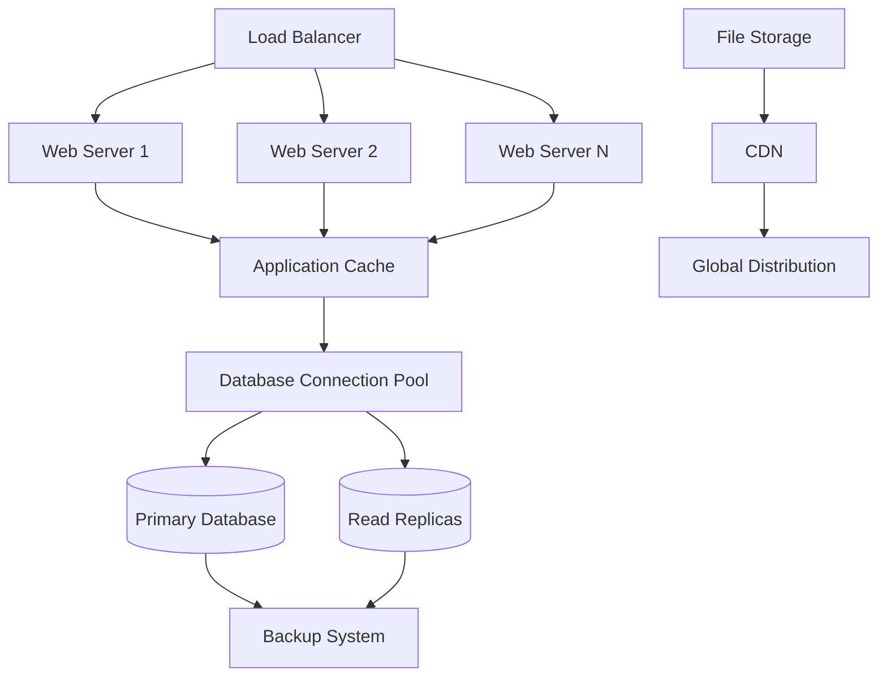
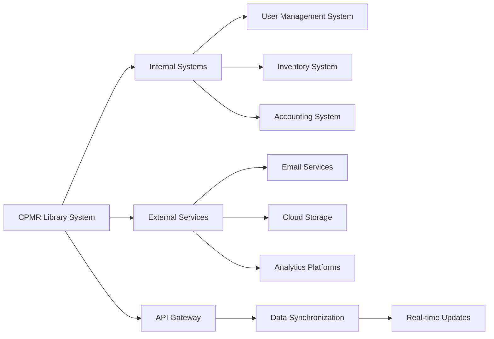
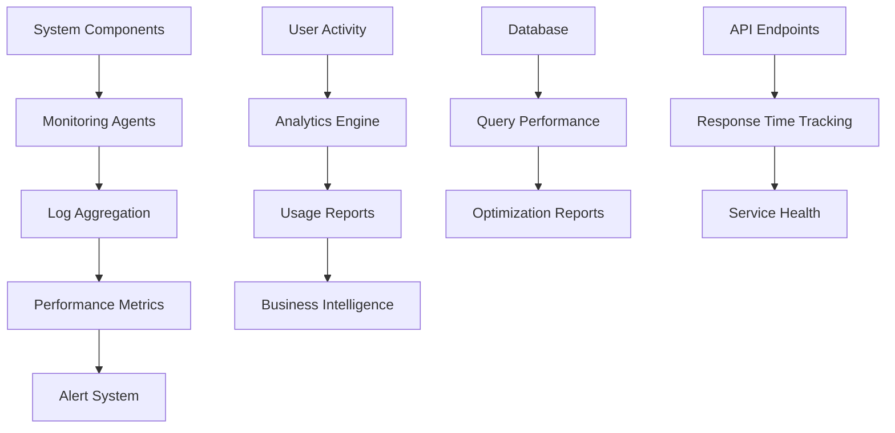

# CPMR Library Management System
## System Architecture Diagram

## 🏗️ High-Level Architecture

## 📊 Data Flow Architecture

## 🔧 Component Architecture

```mermaid
graph TD
    A[Frontend Application] --> B[Dashboard Components]
    A --> C[Authentication Module]
    A --> D[Data Visualization]
    
    B --> E[Admin Panel]
    B --> F[Librarian Interface]
    B --> G[User Portal]
    
    C --> H[Login System]
    C --> I[Session Management]
    C --> J[Role Validation]
    
    D --> K[Chart.js Charts]
    D --> L[Real-time Updates]
    
    M[Backend API] --> N[REST Controllers]
    M --> O[Business Logic]
    M --> P[Data Access Layer]
    
    N --> Q[Books Controller]
    N --> R[Members Controller]
    N --> S[Borrowing Controller]
    N --> T[Reports Controller]
    
    O --> U[Validation Logic]
    O --> V[Processing Logic]
    O --> W[Security Checks]
    
    P --> X[Database Queries]
    P --> Y[Connection Pooling]
    P --> Z[Transaction Management]
```

## 🗄️ Database Schema Overview

## 🔄 Data Processing Flow

## 📱 Multi-Device Support Architecture

## 🔒 Security Architecture

## 📈 Scalability Architecture

## 🎯 Integration Architecture

## 📊 Monitoring & Analytics Architecture

## Key Architecture Decisions

### 1. **Separation of Concerns**
- Clear separation between frontend and backend
- API-first approach for future scalability
- Modular component design

### 2. **Security by Design**
- Multi-layer security approach
- JWT-based authentication
- Role-based access control

### 3. **Performance Optimization**
- Database indexing strategies
- Caching mechanisms
- Efficient API responses

### 4. **Scalability Planning**
- Stateless application design
- Database connection pooling
- Load balancing capabilities

### 5. **Maintainability**
- Well-documented codebase
- Standardized coding practices
- Clear API contracts

---

*This architecture supports current requirements while providing foundation for future enhancements and scalability.*